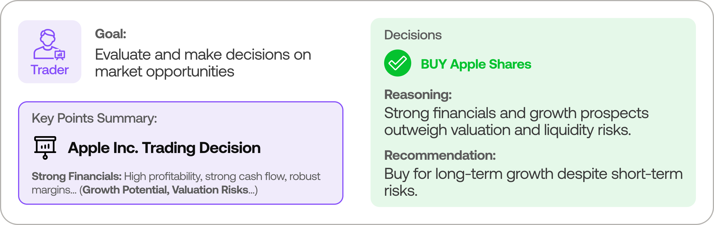
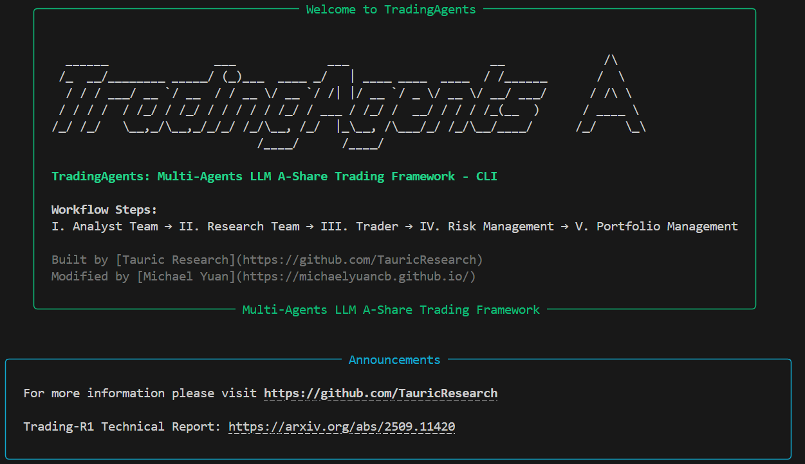
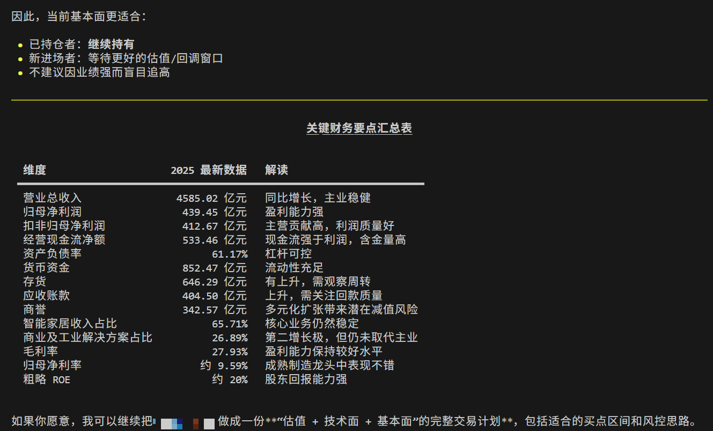
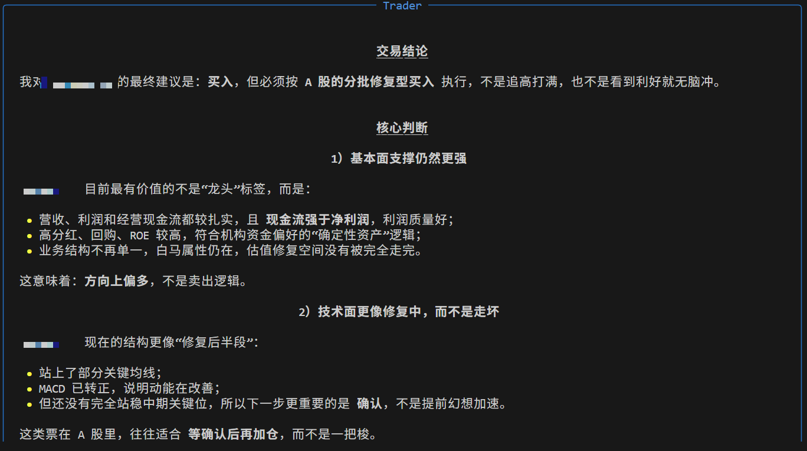

<div align="center">

# TradingAgents-A股版

多 Agent LLM 交易研究框架（A 股二次开发开源版）


</div>

<p align="center">
  <a href="./README.md"></a>
  <a href="./README_en.md"></a>
</p>

<p align="center">
  <a href="#项目定位">项目定位</a> ·
  <a href="#核心特性">核心特性</a> ·
  <a href="#角色协作图谱引用上游图片">角色图谱</a> ·
  <a href="#和历史版本的关键差异">版本差异</a> ·
  <a href="#快速开始">快速开始</a> ·
  <a href="#开源合规说明">开源合规</a>
</p>

<p align="center">
  
</p>

## 项目定位

`TradingAgents-A股版` 是基于 [TradingAgents](https://github.com/TauricResearch/TradingAgents?tab=readme-ov-file) 的衍生开源实现，聚焦 **A 股研究语境** 与 **多 Agent 协同决策流程**。  
目标不是承诺收益，而是提供一个可复现、可解释、可扩展的交易研究框架。

适用场景：

- A 股多因子/多角色研究流程实验
- LLM Agent 在金融任务中的协作机制验证
- 教学演示、课程实验、策略原型开发

## 核心特性

- A 股数据链路：默认 AkShare，覆盖行情、新闻、公告、基本面相关工具。
- 多 Agent 决策闭环：分析师、研究员、交易员、风控与组合管理分工协作。
- 多模型提供方统一接入：OpenAI、Azure OpenAI、Anthropic、Google、xAI、OpenRouter、Ollama。
- CLI 开箱即用：可直接选择标的、交易日期、分析师与模型组合。
- 研究导向的输出：强调过程透明和可复盘，不做黑盒策略包装。

## 角色协作图谱（引用上游图片）

<p align="center">
  
</p>

> 图 1 来源：上游项目 `TauricResearch/TradingAgents` 官方 README（Analyst Team 图示）
> 引用链接：https://github.com/TauricResearch/TradingAgents/blob/main/assets/analyst.png

<p align="center">
  
</p>

> 图 2 来源：上游项目 `TauricResearch/TradingAgents` 官方 README（Research Team 图示）
> 引用链接：https://github.com/TauricResearch/TradingAgents/blob/main/assets/researcher.png

<p align="center">
  
</p>

> 图 3 来源：上游项目 `TauricResearch/TradingAgents` 官方 README（Trader 图示）
> 引用链接：https://github.com/TauricResearch/TradingAgents/blob/main/assets/trader.png

<p align="center">
  
</p>

> 图 4 来源：上游项目 `TauricResearch/TradingAgents` 官方 README（Risk & Portfolio 图示）
> 引用链接：https://github.com/TauricResearch/TradingAgents/blob/main/assets/risk.png

## 和历史版本的关键差异

| 维度 | 历史版本 | 当前版本（A 股） |
|---|---|---|
| 市场语境 | 美股为主 | A 股为主 |
| 数据主干 | 依赖原有美股链路 | 默认 AkShare 数据链路 |
| 研究语言与输出 | 英文语境为主 | 中文研究语境优化 |
| 工程目标 | 原始框架发布 | 面向二次开发与本地可复现研究 |

## CLI 运行预览

<p align="center">
  
</p>

<p align="center">
  
</p>

<p align="center">
  
</p>

## 快速开始

### 1) 安装

```bash
git clone https://gitee.com/yuanchengbo1/trading-agents-a.git
cd trading-agents-a

pip install -e .
```

### 2) 配置环境变量

```bash
cp .env.example .env
```

常见模型密钥（按需配置）：

```bash
export OPENAI_API_KEY=...
export AZURE_API_KEY=...
export GOOGLE_API_KEY=...
export ANTHROPIC_API_KEY=...
export XAI_API_KEY=...
export OPENROUTER_API_KEY=...
```

### 3) 启动 CLI

```bash
tradingagents
# 或
python -m cli.main
```

## Python 调用示例

```python
from tradingagents.graph.trading_graph import TradingAgentsGraph
from tradingagents.default_config import DEFAULT_CONFIG

config = DEFAULT_CONFIG.copy()
config["llm_provider"] = "openai"
config["deep_think_llm"] = "gpt-5.4"
config["quick_think_llm"] = "gpt-5.4-mini"

ta = TradingAgentsGraph(debug=True, config=config)
_, decision = ta.propagate("600519", "2024-05-10")
print(decision)
```

## 项目结构

- `tradingagents/agents/`：各类 Agent 角色实现
- `tradingagents/graph/`：多 Agent 状态编排与流转
- `tradingagents/dataflows/`：A 股数据工具与路由
- `tradingagents/llm_clients/`：多模型提供方客户端封装
- `cli/`：交互式命令行入口
- `tests/`：单元测试

## 开发与测试

```bash
python -m unittest discover tests
python main.py
```

## 开源合规说明

本仓库为衍生开源项目（derivative work），遵循 Apache-2.0 许可证。

1. 上游参考项目：`TauricResearch/TradingAgents`。
2. 本仓库与上游团队无隶属关系，不代表上游官方立场。
3. 若出现上游项目名称，仅用于来源说明，不构成品牌背书。
4. 历史版文档保留在 `README_legacy.md`。
5. 使用与分发前，请同步审阅仓库 `LICENSE` 及第三方依赖许可。
6. README 中部分配图引用自上游官方 README，原图文件位于本仓库 `assets/` 目录并保留来源说明。
7. 架构总览图 `assets/schema.png` 引用自上游图片资源：`https://github.com/TauricResearch/TradingAgents/blob/main/assets/schema.png`。

## 免责声明

本项目仅用于学术研究、工程实验与教学演示，不构成投资建议。任何实盘交易决策及风险由使用者自行承担。

## 开发者与贡献

- 二次开发者：[michaelyuan](https://michaelyuancb.github.io/)
- 如果该项目对你有帮助，欢迎 Star 与分享
