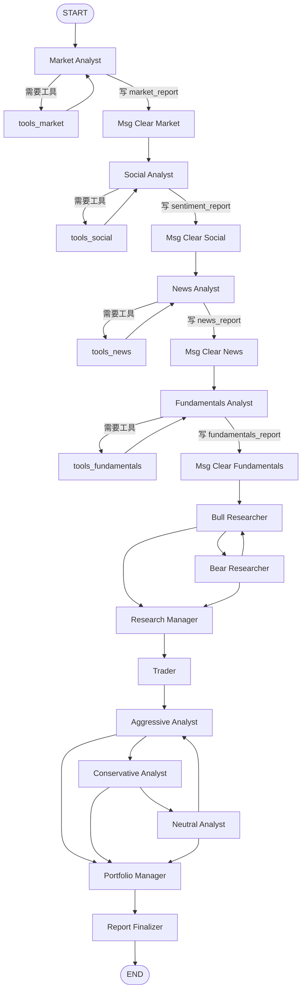

# TradingAgents 多智能体协作与数据流说明

这份文档面向“不太懂金融、但能看懂程序流程”的开发者，解释一次股票分析从输入股票代码到生成最终报告，中间到底经历了什么、数据从哪里来、每个 Agent 读了什么又写了什么。

对应代码主要在：

- `cli/main.py`：命令行入口、用户选择、实时展示、保存报告
- `tradingagents/graph/setup.py`：LangGraph 多 Agent 工作流拓扑
- `tradingagents/graph/propagation.py`：初始 `AgentState` 状态
- `tradingagents/graph/trading_graph.py`：创建 LLM、工具节点、图执行与日志
- `tradingagents/agents/`：各个 Agent 的提示词和状态读写
- `tradingagents/data_tools/`：数据工具注册、缓存、执行
- `tradingagents/dataflows/a_share.py`：A 股 AkShare 数据获取与格式化

## 一句话总览

一次分析可以理解成一条流水线：

```text
用户选择股票和日期
  -> 4 类分析师各自查数据并写报告
  -> 看多/看空研究员围绕报告辩论
  -> 研究经理给出投资计划
  -> 交易员把投资计划变成交易建议
  -> 激进/保守/中性风控继续辩论
  -> 投资组合经理给出最终评级和操作方案
  -> 报告整理节点把所有中间结果复制成最终报告字段
```

这里有两个非常重要的概念：

1. `AgentState` 是整条流水线共享的“大白板”。每个 Agent 都从里面读字段，再写回新的字段。
2. `messages` 是临时草稿区，主要用于某个分析师和工具之间来回对话。每个分析师结束后会被 `Msg Clear ...` 节点清空，只留下一个 `Continue` 占位消息。真正传给后续 Agent 的不是 `messages`，而是 `market_report`、`news_report` 等结构化状态字段。

## 图结构

默认启用的分析师顺序是：

```text
Market Analyst -> Social Analyst -> News Analyst -> Fundamentals Analyst
```

完整图大致如下：



分析师节点是否进入工具节点，由 `ConditionalLogic.should_continue_*` 判断：如果 LLM 的最后一条消息里有 `tool_calls`，就去对应 `tools_*` 节点执行工具；如果没有工具调用，说明报告写完了，进入 `Msg Clear ...`。

## 从 CLI 到初始状态

运行 `python -m cli.main` 后，CLI 会让你选择：

- 股票代码，例如 `600036`
- 分析日期，例如 `2026-05-04`
- 启用哪些分析师：market、social、news、fundamentals
- 研究深度：影响看多/看空辩论轮数和风控辩论轮数
- LLM provider 和 quick/deep 模型

然后 `cli/main.py` 会构造运行时配置，并创建：

```python
TradingAgentsGraph(
    selected_analyst_keys,
    config=config,
    debug=True,
    callbacks=[stats_handler],
)
```

初始状态由 `Propagator.create_initial_state(company_name, trade_date)` 创建。关键字段如下：

| 字段 | 初始值 | 用途 |
| --- | --- | --- |
| `messages` | `[("human", 股票代码)]` | 给第一个分析师的临时消息 |
| `company_of_interest` | 股票代码 | 后续所有工具和 Agent 使用的标的 |
| `trade_date` | 分析日期 | 数据查询截止日期或当前分析日期 |
| `investment_debate_state` | 空的看多/看空辩论状态 | 研究团队使用 |
| `risk_debate_state` | 空的风控辩论状态 | 风控团队使用 |
| `market_report` | 空字符串 | 市场/技术分析报告 |
| `sentiment_report` | 空字符串 | 情绪分析报告 |
| `news_report` | 空字符串 | 新闻/公告/政策分析报告 |
| `fundamentals_report` | 空字符串 | 基本面分析报告 |
| `investment_plan` | 空字符串 | 研究经理输出的投资计划 |
| `trader_investment_plan` | 空字符串 | 交易员输出的交易计划 |
| `final_trade_decision` | 空字符串 | 投资组合经理输出的最终决策 |

## 第一阶段：分析师团队查数据并写报告

分析师团队的职责是把外部数据变成 4 份可读报告。每个分析师都可以自己决定要不要调用工具、调用几次工具。工具返回的是文本或 CSV 风格的表格，LLM 再把这些数据整理成报告。

### 1. Market Analyst：市场/技术分析

代码：`tradingagents/agents/analysts/market_analyst.py`

它主要回答：

- 这只股票最近价格怎么走？
- 成交量、成交额、换手率是否支持这个走势？
- 技术指标是否支持上涨、下跌，还是震荡？
- A 股交易限制，例如 T+1、涨跌停，对执行有什么影响？

可用工具：

| 工具 | 底层数据 | 作用 |
| --- | --- | --- |
| `get_stock_data(symbol, start_date, end_date)` | AkShare 日线行情 | 获取开盘价、最高价、最低价、收盘价、成交量、成交额、涨跌幅、换手率 |
| `get_indicators(symbol, indicator, curr_date, look_back_days)` | 本地 OHLCV + stockstats | 计算 RSI、MACD、布林带、均线、ATR 等技术指标 |

输出字段：

```text
market_report
```

给后续阶段的意义：

市场报告是“价格行为”的证据。后面的看多/看空研究员、交易员和风控都会引用它判断：现在是趋势行情、反弹行情、还是容易冲高回落。

### 2. Social Analyst：情绪分析

代码：`tradingagents/agents/analysts/social_media_analyst.py`

这个名字叫 Social，但当前 A 股实现不是直接抓微博、雪球等社交平台，而是用公司新闻作为“情绪代理”。也就是说，它从中文财经新闻里推断市场叙事和投资者关注度。

它主要回答：

- 媒体报道偏正面还是负面？
- 这只股票有没有被反复提及的热点叙事？
- 情绪是升温、过热，还是转弱？
- 短期交易上，情绪可能带来追涨还是回落风险？

可用工具：

| 工具 | 底层数据 | 作用 |
| --- | --- | --- |
| `get_news(ticker, start_date, end_date)` | AkShare `stock_news_em` | 获取个股相关新闻 |

输出字段：

```text
sentiment_report
```

给后续阶段的意义：

情绪报告是“市场愿不愿意讲这个故事”的证据。A 股短线里，题材、热度、资金情绪会影响价格波动。

### 3. News Analyst：新闻、公告、政策分析

代码：`tradingagents/agents/analysts/news_analyst.py`

它主要回答：

- 公司最近有什么新闻？
- 有没有公告、业绩披露、风险提示？
- 市场层面有没有政策、宏观、流动性变化？
- 这些事件对短线交易有什么催化或风险？

可用工具：

| 工具 | 底层数据 | 作用 |
| --- | --- | --- |
| `get_news(ticker, start_date, end_date)` | AkShare `stock_news_em` | 个股新闻 |
| `get_market_news(curr_date, look_back_days, limit)` | AkShare `stock_info_global_em` | 市场、政策、宏观快讯 |
| `get_company_announcements(ticker, start_date, end_date, category)` | AkShare `stock_notice_report` | 上市公司公告 |

输出字段：

```text
news_report
```

给后续阶段的意义：

新闻报告是“发生了什么事件”的证据。后续 Agent 会用它判断是否存在政策催化、业绩窗口、监管风险或突发利空。

### 4. Fundamentals Analyst：基本面分析

代码：`tradingagents/agents/analysts/fundamentals_analyst.py`

基本面可以理解为“公司本身质量怎么样”。它不像技术分析看价格图，而是看公司业务、利润、现金流和资产负债情况。

它主要回答：

- 公司主营业务是什么？
- 收入和利润质量如何？
- 现金流是否健康？
- 资产负债表有没有风险，比如存货、应收账款、商誉、负债压力？
- 基本面是否支持交易机会，还是提示估值/质量风险？

可用工具：

| 工具 | 底层数据 | 作用 |
| --- | --- | --- |
| `get_fundamentals(ticker, curr_date)` | AkShare 公司概况、主营、财务摘要 | 综合公司基本面 |
| `get_balance_sheet(ticker, freq, curr_date)` | AkShare 资产负债表 | 看资产、负债、权益、存货、应收、商誉等 |
| `get_cashflow(ticker, freq, curr_date)` | AkShare 现金流量表 | 看经营现金流、投资现金流、融资现金流 |
| `get_income_statement(ticker, freq, curr_date)` | AkShare 利润表 | 看收入、利润、净利润、每股收益等 |

输出字段：

```text
fundamentals_report
```

给后续阶段的意义：

基本面报告是“公司值不值得相信”的证据。它能帮助后续 Agent 区分：价格上涨是有业绩支撑，还是只是题材炒作。

## 分析师工具调用是怎么发生的

每个分析师节点都大致是这个模式：

```text
1. 根据股票代码和日期构造 prompt
2. 把可用工具绑定到 LLM
3. LLM 如果觉得需要数据，就返回 tool_calls
4. LangGraph 进入 ToolNode 执行工具
5. 工具结果作为 ToolMessage 追加到 messages
6. 回到同一个分析师
7. LLM 看到工具结果后，可能继续调工具，也可能写最终报告
8. 如果没有新的 tool_calls，报告写入 AgentState 的对应字段
```

注意：分析师之间不会直接把 `messages` 传来传去。每个分析师结束后，`create_msg_delete()` 会删除旧消息，只留下 `HumanMessage("Continue")`。这样做是为了避免工具消息过多、上下文污染和兼容某些模型协议。

持久流转的是这些字段：

```text
market_report
sentiment_report
news_report
fundamentals_report
```

## 数据从哪里来

当前默认数据供应商是 AkShare。配置在 `tradingagents/default_config.py`：

```python
"data_vendors": {
    "core_stock_apis": "akshare",
    "technical_indicators": "akshare",
    "fundamental_data": "akshare",
    "news_data": "akshare",
}
```

调用路径是：

```text
Agent LLM
  -> LangChain tool，例如 get_stock_data
  -> tradingagents/agents/utils/*_tools.py
  -> run_data_tool(...)
  -> CachedDataToolExecutor
  -> DataToolRegistry
  -> route_to_vendor(...)
  -> tradingagents/dataflows/a_share.py
  -> AkShare API
  -> 格式化成文本/表格
  -> 返回给 LLM
```

数据工具执行器会做本地缓存：

```text
tradingagents/local_data/data_tools/cache/
```

缓存键由工具名和参数生成。也就是说，同一个工具、同一组参数再次调用时，会优先读本地缓存，而不是重复请求外部数据源。

还有一个旧的行情缓存目录：

```text
tradingagents/dataflows/data_cache/
```

技术指标会依赖本地 OHLCV 行情数据计算，所以 Market Analyst 的提示词会要求先调用 `get_stock_data`，再调用 `get_indicators`。

## 第二阶段：看多/看空研究员辩论

分析师团队结束后，图进入研究团队：

```text
Bull Researcher <-> Bear Researcher -> Research Manager
```

### Bull Researcher：看多研究员

代码：`tradingagents/agents/researchers/bull_researcher.py`

读取字段：

```text
market_report
sentiment_report
news_report
fundamentals_report
investment_debate_state.history
investment_debate_state.current_response
```

它会站在“可以买、值得乐观”的角度，尝试证明：

- 技术结构是否支持上涨
- 新闻或政策是否形成催化
- 情绪是否可能继续升温
- 基本面是否能支撑估值修复或增长预期
- 看空方担心的问题是否可以被反驳

写回字段：

```text
investment_debate_state.bull_history
investment_debate_state.history
investment_debate_state.current_response
investment_debate_state.latest_speaker = "Bull Researcher"
investment_debate_state.count += 1
```

### Bear Researcher：看空研究员

代码：`tradingagents/agents/researchers/bear_researcher.py`

读取字段和 Bull 类似，但立场相反。它会强调：

- 技术走势是否已经转弱
- 情绪是否过热、题材是否退潮
- 新闻是否有负面因素
- 基本面是否不支持当前估值
- 看多方的乐观假设是否站不住

写回字段：

```text
investment_debate_state.bear_history
investment_debate_state.history
investment_debate_state.current_response
investment_debate_state.latest_speaker = "Bear Researcher"
investment_debate_state.count += 1
```

### 辩论轮数如何控制

`ConditionalLogic.should_continue_debate()` 会检查：

```python
state["investment_debate_state"]["count"] >= 2 * max_debate_rounds
```

如果还没达到上限，就在 Bull 和 Bear 之间切换。达到上限后，进入 Research Manager。

例如 `max_debate_rounds = 2`，通常会有 4 次发言：

```text
Bull -> Bear -> Bull -> Bear -> Research Manager
```

## 第三阶段：Research Manager 形成投资计划

代码：`tradingagents/agents/managers/research_manager.py`

Research Manager 像“研究主管”。它不再查新数据，而是阅读：

```text
market_report
sentiment_report
news_report
fundamentals_report
investment_debate_state.history
```

然后做三件事：

1. 总结看多和看空双方最有力的证据。
2. 在 Buy / Sell / Hold 中给出倾向。
3. 生成给交易员看的投资计划。

写回字段：

```text
investment_debate_state.judge_decision
investment_debate_state.latest_speaker = "Research Manager"
investment_plan
```

这里的 `investment_plan` 是后续 Trader 的主要输入。

## 第四阶段：Trader 形成交易计划

代码：`tradingagents/agents/trader/trader.py`

Trader 像“执行交易的人”。它读取：

```text
investment_plan
market_report
sentiment_report
news_report
fundamentals_report
```

它要把研究经理的判断转成更接近交易动作的建议，例如：

- 买、卖、持有
- 是否适合次日执行
- 是否适合短线波段
- 要不要观察而不是立刻交易
- A 股 T+1、涨跌停、成交额、换手率会不会影响执行

写回字段：

```text
trader_investment_plan
messages
sender = "Trader"
```

Trader 的提示词要求保留一行机器可读结果：

```text
FINAL TRANSACTION PROPOSAL: **BUY/HOLD/SELL**
```

不过最终报告不是直接用 Trader 的这行作为最终答案。后面还有风控团队和投资组合经理。

## 第五阶段：风控团队辩论

Trader 之后进入风险管理团队：

```text
Aggressive Analyst -> Conservative Analyst -> Neutral Analyst -> ...
```

它们都读取：

```text
trader_investment_plan
market_report
sentiment_report
news_report
fundamentals_report
risk_debate_state.history
```

不同点在于立场。

### Aggressive Analyst：激进派

代码：`tradingagents/agents/risk_mgmt/aggressive_debator.py`

它强调高收益机会，尤其是政策催化、板块轮动、资金情绪可能带来的上行空间。

写回：

```text
risk_debate_state.aggressive_history
risk_debate_state.current_aggressive_response
risk_debate_state.latest_speaker = "Aggressive"
risk_debate_state.count += 1
```

### Conservative Analyst：保守派

代码：`tradingagents/agents/risk_mgmt/conservative_debator.py`

它强调保护本金，关注高换手题材、流动性差、跌停无法卖出、监管风险等。

写回：

```text
risk_debate_state.conservative_history
risk_debate_state.current_conservative_response
risk_debate_state.latest_speaker = "Conservative"
risk_debate_state.count += 1
```

### Neutral Analyst：中性派

代码：`tradingagents/agents/risk_mgmt/neutral_debator.py`

它平衡激进和保守观点，常见输出会关注：

- 是否参与
- 仓位要多大
- 触发价格或风险位
- 是否观察比交易更合适

写回：

```text
risk_debate_state.neutral_history
risk_debate_state.current_neutral_response
risk_debate_state.latest_speaker = "Neutral"
risk_debate_state.count += 1
```

### 风控轮数如何控制

`ConditionalLogic.should_continue_risk_analysis()` 会检查：

```python
state["risk_debate_state"]["count"] >= 3 * max_risk_discuss_rounds
```

如果还没达到上限，就按：

```text
Aggressive -> Conservative -> Neutral -> Aggressive ...
```

达到上限后，进入 Portfolio Manager。

## 第六阶段：Portfolio Manager 最终拍板

代码：`tradingagents/agents/managers/portfolio_manager.py`

Portfolio Manager 像“最终决策人”。它读取：

```text
risk_debate_state.history
investment_plan
market_report
sentiment_report
news_report
fundamentals_report
```

它输出一个五档评级，而不是只有三档：

| 评级 | 大致含义 |
| --- | --- |
| `Buy` | 明确买入或加仓 |
| `Overweight` | 偏乐观，逐步增加暴露 |
| `Hold` | 维持或观望 |
| `Underweight` | 降低仓位或部分止盈 |
| `Sell` | 卖出或避免买入 |

写回字段：

```text
risk_debate_state.judge_decision
risk_debate_state.latest_speaker = "Judge"
final_trade_decision
```

`final_trade_decision` 是最重要的最终决策文本。

随后 `SignalProcessor.process_signal()` 会再调用一次 quick LLM，从完整文本里抽取一个机器可读评级：

```text
BUY / OVERWEIGHT / HOLD / UNDERWEIGHT / SELL
```

## 第七阶段：Report Finalizer 整理最终报告字段

代码：`tradingagents/agents/managers/report_finalizer.py`

这个节点目前不重新总结、不改写内容，只做字段复制：

| 来源字段 | 最终报告字段 |
| --- | --- |
| `market_report` | `final_market_report` |
| `sentiment_report` | `final_sentiment_report` |
| `news_report` | `final_news_report` |
| `fundamentals_report` | `final_fundamentals_report` |
| `investment_plan` | `final_investment_plan_report` |
| `trader_investment_plan` | `final_trader_investment_plan_report` |
| `final_trade_decision` | `final_trade_decision_report` |

CLI 保存报告时会按目录写出：

```text
reports/<ticker>_<timestamp>/
  complete_report.md
  1_analysts/
    market_report.md
    sentiment_report.md
    news_report.md
    fundamentals_report.md
  2_research/
    investment_plan.md
  3_trading/
    trader_investment_plan_report.md
  4_portfolio/
    final_trade_decision_report.md
```

运行中间过程还会写：

```text
results/<ticker>/<analysis_date>/message_tool.log
results/<ticker>/<analysis_date>/reports/
```

`TradingAgentsGraph._log_state()` 还会把最终状态写到：

```text
eval_results/<ticker>/TradingAgentsStrategy_logs/full_states_log_<trade_date>.json
```

这个 JSON 是理解完整数据流最有用的产物之一。

## 状态字段总表

| 字段 | 写入者 | 主要读取者 | 内容 |
| --- | --- | --- | --- |
| `messages` | 初始状态、分析师、工具节点、Trader | 当前分析师工具循环、CLI 展示 | 临时对话和工具调用结果 |
| `market_report` | Market Analyst | Bull/Bear、Research Manager、Trader、风控、Portfolio Manager | 价格、成交量、技术指标、A 股交易约束 |
| `sentiment_report` | Social Analyst | Bull/Bear、Research Manager、Trader、风控、Portfolio Manager | 媒体情绪、市场叙事、关注度 |
| `news_report` | News Analyst | Bull/Bear、Research Manager、Trader、风控、Portfolio Manager | 公司新闻、公告、政策、宏观快讯 |
| `fundamentals_report` | Fundamentals Analyst | Bull/Bear、Research Manager、Trader、风控、Portfolio Manager | 公司业务、财报、现金流、资产负债 |
| `investment_debate_state.history` | Bull/Bear | Bull/Bear、Research Manager | 看多/看空完整辩论 |
| `investment_debate_state.bull_history` | Bull | Research Manager、反思模块 | 看多方发言 |
| `investment_debate_state.bear_history` | Bear | Research Manager、反思模块 | 看空方发言 |
| `investment_plan` | Research Manager | Trader、Portfolio Manager、Report Finalizer | 研究团队形成的投资计划 |
| `trader_investment_plan` | Trader | 风控团队、Report Finalizer | 交易员执行建议 |
| `risk_debate_state.history` | Aggressive/Conservative/Neutral | 风控团队、Portfolio Manager | 风控三方完整辩论 |
| `risk_debate_state.*_history` | 对应风控 Agent | Portfolio Manager、反思模块 | 各风控视角发言 |
| `final_trade_decision` | Portfolio Manager | SignalProcessor、Report Finalizer、CLI | 最终评级和执行摘要 |
| `final_*_report` | Report Finalizer | CLI、保存报告 | 对外展示报告字段 |

## 金融术语速查

| 术语 | 程序员式解释 |
| --- | --- |
| A 股 | 中国大陆交易所上市股票，常见后缀 `.SH` 上海、`.SZ` 深圳、`.BJ` 北交所 |
| OHLCV | 一根 K 线的基础数据：Open 开盘、High 最高、Low 最低、Close 收盘、Volume 成交量 |
| 成交额 | 交易金额，约等于价格乘成交量。成交额太低时，模型会担心买卖不顺畅 |
| 换手率 | 一段时间内股票被交易的比例。太低可能没流动性，太高可能情绪过热 |
| 技术指标 | 从价格和成交量计算出来的衍生特征，比如 RSI、MACD、均线、布林带 |
| 基本面 | 公司自己的经营质量，例如收入、利润、现金流、负债 |
| 资产负债表 | 公司在某个时间点有什么资产、欠了多少债 |
| 利润表 | 公司一段时间赚了多少钱、收入和成本怎么样 |
| 现金流量表 | 真正现金流入流出情况。利润好但现金流差，可能有质量问题 |
| 归母净利润 | 归属于上市公司股东的净利润，常用于看公司核心盈利 |
| 扣非净利润 | 扣除非经常性损益后的利润，更接近主营业务赚钱能力 |
| T+1 | A 股当天买入，通常下一个交易日才能卖出 |
| 涨跌停 | A 股单日涨跌幅有限制，价格到限制附近时可能买不到或卖不出 |
| 催化 | 可能推动价格变化的事件，例如政策、业绩、订单、行业消息 |
| 题材退潮 | 市场不再追捧某个热点，相关股票可能快速降温 |

## 一个具体例子：分析 `600036` 时发生什么

假设你输入：

```text
ticker = 600036
trade_date = 2026-05-04
analysts = market, social, news, fundamentals
research_depth = 2
```

一次典型运行会像这样：

1. CLI 把 `600036` 和 `2026-05-04` 放进初始 `AgentState`。
2. Market Analyst 看到股票和日期，先调用 `get_stock_data` 拉一段行情，再调用若干 `get_indicators`。它拿到价格表和指标文本后，写出 `market_report`。
3. `Msg Clear Market` 清空临时 `messages`，但 `market_report` 保留在 state 里。
4. Social Analyst 调 `get_news`，从新闻里推断市场情绪，写 `sentiment_report`。
5. News Analyst 调 `get_news`、`get_market_news`、`get_company_announcements`，写 `news_report`。
6. Fundamentals Analyst 调 `get_fundamentals` 和财务报表工具，写 `fundamentals_report`。
7. Bull Researcher 读取 4 份报告，写一段看多理由到 `investment_debate_state`。
8. Bear Researcher 读取同样的 4 份报告和看多发言，写一段反驳。
9. 如果研究深度是 2，看多/看空通常再各发言一次。
10. Research Manager 阅读整个辩论，写 `investment_plan`。
11. Trader 根据 `investment_plan` 和 4 份报告写 `trader_investment_plan`。
12. Aggressive、Conservative、Neutral 三个风控角色围绕 Trader 的计划继续辩论。
13. Portfolio Manager 阅读风控辩论，写 `final_trade_decision`。
14. Report Finalizer 把中间字段复制到 `final_*` 字段。
15. CLI 把报告展示出来，并按你的选择保存到 `reports/`。

## 调试时看哪里

如果你想知道“某次运行到底发生了什么”，优先看这些文件：

| 位置 | 用途 |
| --- | --- |
| `results/<ticker>/<analysis_date>/message_tool.log` | 运行时消息和工具调用记录 |
| `results/<ticker>/<analysis_date>/reports/` | CLI 实时保存的报告片段 |
| `reports/<ticker>_<timestamp>/complete_report.md` | 用户选择保存后的完整报告 |
| `eval_results/<ticker>/TradingAgentsStrategy_logs/full_states_log_<trade_date>.json` | 最完整的最终状态快照 |
| `tradingagents/local_data/data_tools/cache/` | 数据工具缓存结果 |
| `tradingagents/dataflows/data_cache/` | 行情数据缓存 |

如果你想改流程：

| 想改什么 | 看这个文件 |
| --- | --- |
| 调整 Agent 顺序或增加节点 | `tradingagents/graph/setup.py` |
| 调整辩论轮数逻辑 | `tradingagents/graph/conditional_logic.py` |
| 改某个分析师的职责或提示词 | `tradingagents/agents/analysts/*.py` |
| 改数据工具 | `tradingagents/agents/utils/*_tools.py` 和 `tradingagents/dataflows/a_share.py` |
| 改最终报告保存格式 | `cli/main.py` 的 `save_report_to_disk` |
| 改最终评级抽取 | `tradingagents/graph/signal_processing.py` |

## 常见运行问题：MiniMax 超时

你这次看到的 `APITimeoutError: Request timed out` 发生在 `Bear Researcher`，不是 API Key 错误。前面 4 个分析师已经完成，说明鉴权和数据工具都能工作。

真正的问题是：MiniMax M2.7 默认会把推理过程包在 `<think>...</think>` 里返回。如果这些内容被当成正式报告写入 state，后面的 Bull/Bear Researcher 会把“报告正文 + 大量思考过程 + 辩论历史”一起塞进下一次 LLM 请求。你的界面里已经显示 `Tokens: 177.6k↑ 34.4k↓`，这说明上下文非常大，到了 Bear Researcher 这一步就容易超过默认 180 秒读超时。

当前适配里已经做了三层保护：

1. 请求 MiniMax 时默认开启 `reasoning_split=true`，让模型把推理和正文拆开。
2. `normalize_content()` 会清理正文里的 `<think>...</think>`，避免思考过程进入下游报告字段。
3. MiniMax 单独使用更长的 `MINIMAX_TIMEOUT`，并用 `MINIMAX_MAX_TOKENS` 控制单次输出长度。

如果以后还遇到超时，优先降低 `research_depth`、`max_debate_rounds` 或只选择必要的分析师，因为这些参数会直接放大后续 Agent 的输入上下文。

## 当前实现的几个注意点

1. Social Analyst 不是直接抓社交媒体，而是用公司新闻推断情绪。
2. 分析师之间不会互相读取对方的临时 `messages`；后续研究团队读取的是最终报告字段。
3. Report Finalizer 目前只是复制字段，不做二次润色。
4. 记忆模块 `FinancialSituationMemory` 是 BM25 本地检索，只有调用 `reflect_and_remember(returns_losses)` 后才会加入新经验；普通 CLI 分析流程不会自动知道未来收益。
5. AkShare 是外部数据源，数据可用性、字段名、接口稳定性都可能影响工具结果。工具通常会把错误格式化成文本交给 LLM，而不是直接让整个流程崩掉。
6. 这套系统生成的是研究和交易辅助报告，不是确定收益承诺，也不应当被当作投资建议。
